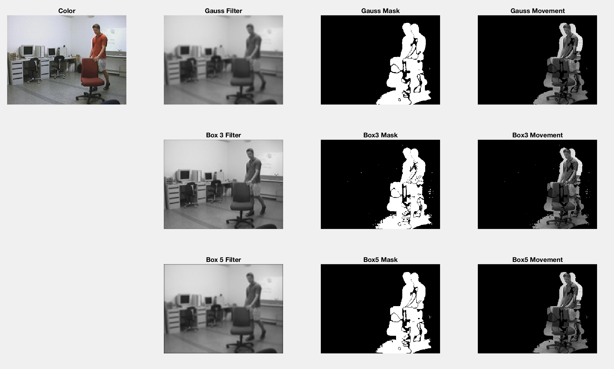

# Project 1: Motion Detection

## Introduction
This project explored motion detection and several factors that affect the
efficacy of motion detection in video. We compared gaussian and temporal
differential filters for taking the differences between frames, as well as the
effect of spatial filters (3x3 Box, 5x5 Box, Gaussian) on performance. Further,
we evaluated the standard deviation within the frame derivates to find the best
values to use as for cutoff.

## Algorithms
There were three main components to our processing pipeline: Spatial Filtering,
Temporal Filtering, and Thresholding.

### Spatial Filters
  We compared three spatial filters: 3x3 Box, 5x5 Box, and Gaussian. The purpose of
  the spatial filters were to blur frames, smoothing out high frequency noise. As
  the images grew more blurry, chunks of movement were better captured and as a
  result, larger groupings of movement were captured (as opposed to smaller
  disjoint chunks).

  

  In the comparison of filters, we see that as the amount of blur INCREASES, the
  size of chunks grows larger and boundaries have smoother edges. This is a result
  of the high frequency noise being filtered out. Box3 which only uses a 3x3
  window around each pixel is less blurry than Box5. Looking at the mask produced
  by Box3 shows that the edges are sharper and that the filtered chunks are larger.

  This comparison shows that when trying to capture motion, a the larger the blur
  present in images, the larger and clearer chunks of motion are captured.

### Temporal Filters
  We used two different temporal filters to calculate the derivatives between
  image frames. The first filter was a basic differential operator. The derivative
  of frame `k` was found by taking the values of frame `k+1` and subtracting out
  the values of frame `k-1`. The result was an image representing the difference
  between the two frames.

  We compared this to an implementation that convolved the differential
  matrix by a 1D gaussian filter. 

### Thresholding

## Parameter Values

## Observations and Conclusions
