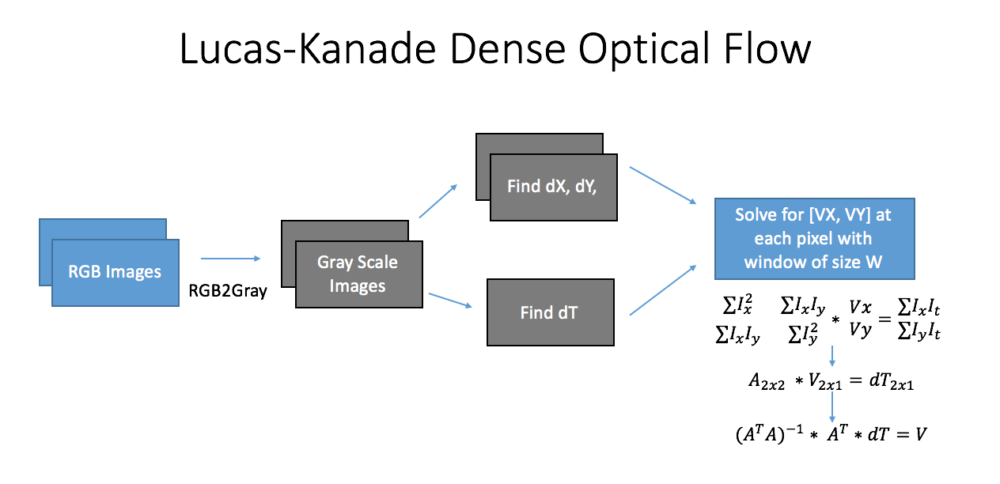
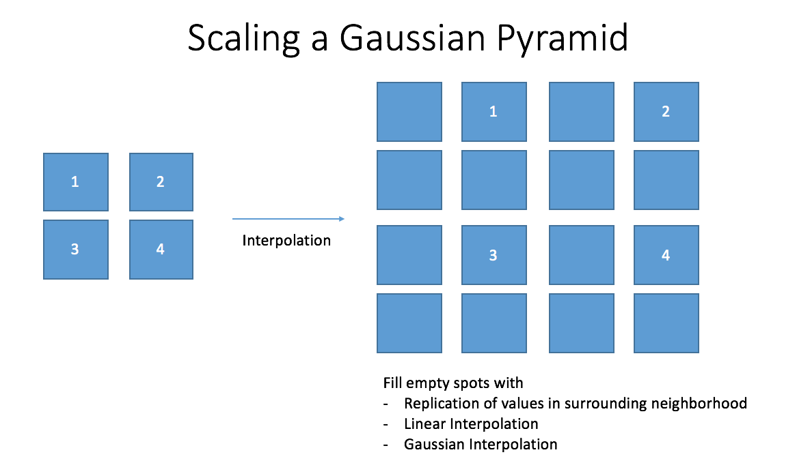
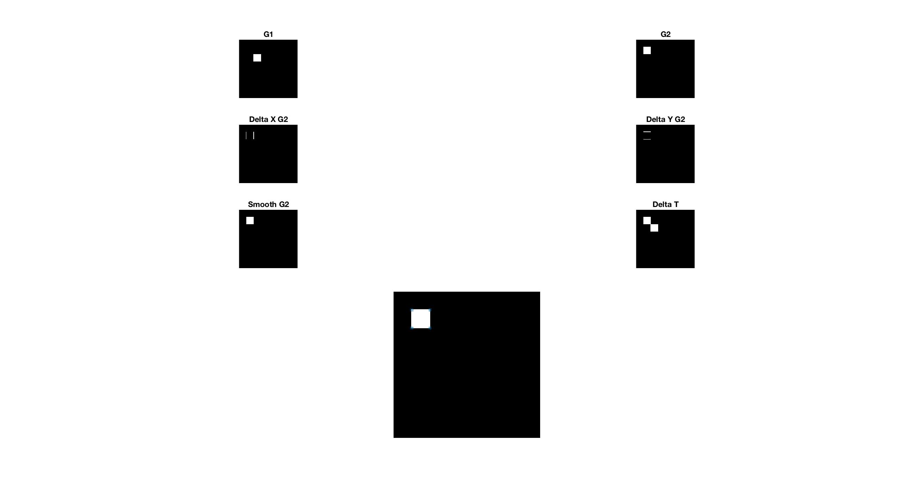
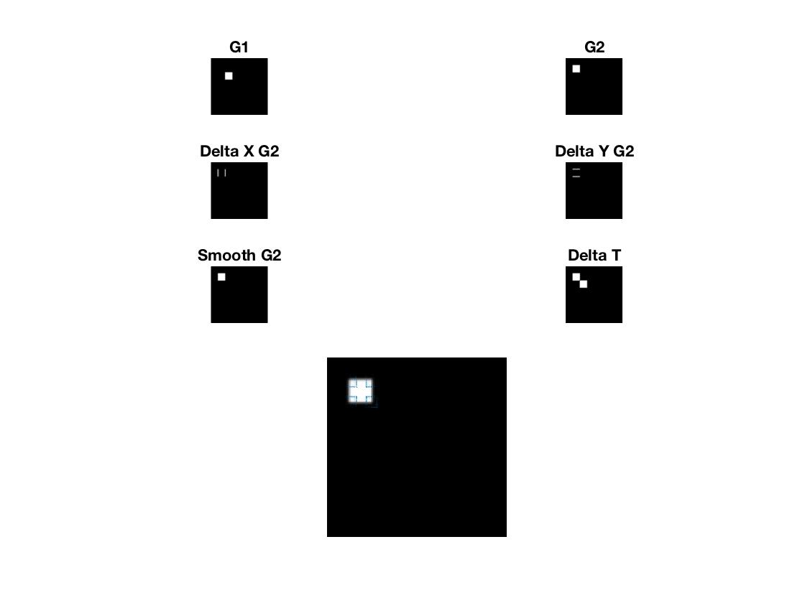
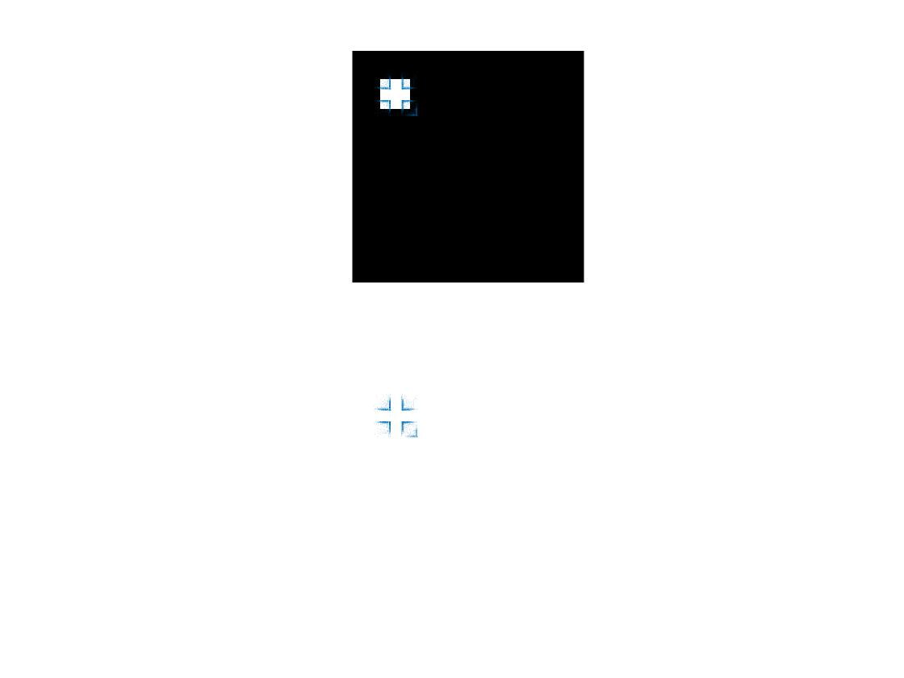
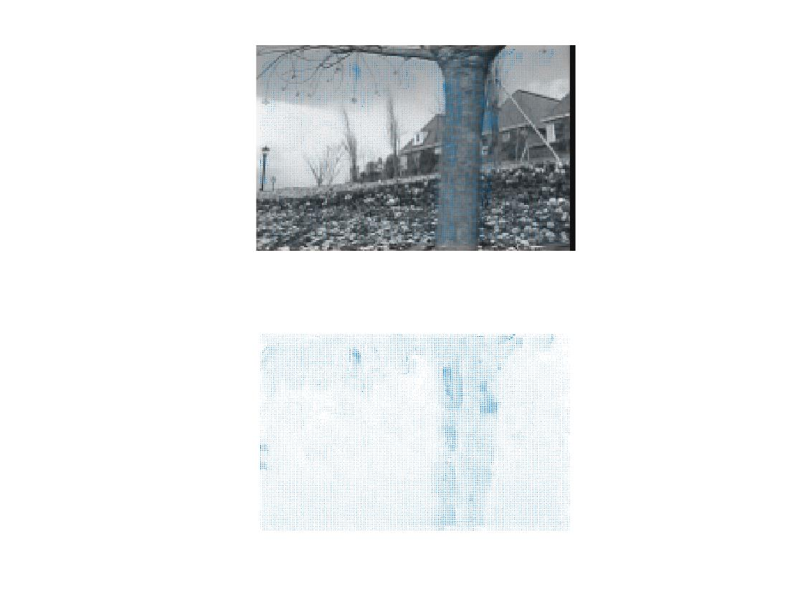

# Project 3: Optical Flow

## Abstract
In this project, I implemented the Lucas-Kanade method of estimating dense
optical flow (OF) from a pair of related images. On top of the normal optical flow
algorithm, I also implemented a Gaussian pyramid to better track large and small
scale flows.

## Algorithm

The Lucas Kanade algorithm starts by converting both images to gray scale. From
the gray scale images, we then computed the spatial intensity gradients `dX`
and `dY` of image2. We then compute the temporal gradient the same way we did in
project 1, by subtracting the second image from the first. We then collect the
terms in an `NxN` window centered around each pixel from the `dX` and `dY`
spatial gradients and combine them in a single `N^2x2` matrix `A`. It is
interesting to note, the resulting matrix of `A^T * A` is actually the Harris
Corner Matrix.

The basic overview for dense optical flow is shown in the figure below.

The disadvantage of the basic Lucas-Kanade algorithm is that large motions
are difficult to capture and often introduce noise into the results. One
way to address this issue is to take the OF at multiple scales - starting at
the smallest version of the image and propagating the velocity vectors down to
larger versions of the image. This works because small movements in the
original sized images will be lost as the image is shrinks - leaving the larger
flows in the  smaller images. The OF from smaller images
can then be propagated into the next layer and be used to help find the OF at
the larger layer. This new flow layer will be based on the original flow layer
but will now capture more of the smaller movements previously lost in the
shrunken image. This process repeats until the image has been returned to its
normal size.

Smaller versions of the image are found by applying a Gaussian Blur to the image,
and then subsampling every other row and column in the image. This effectively
reduces the image to 1/4 (half the rows and half the cols). Blurring helps reduce
the amount of data lost in the subsample. A flow chart for the process of building
a Gaussian Pyramid is shown in the following figure.

Once OF is found at the top of the pyramid, results can be propagated down 
through interpolation. In the interpolation, each pixel value at location `(i, j)`
is copied into a matrix of twice the width and height at location `(2i, 2j)`. 
The empty gaps in the new matrix can be filled using either replication, a 
linear interpolation, or a Gaussian interpolation. 

## Experiments

The best way to sanity check the results of our algorithm was to run the OF 
algorithm on a simple, computer generated image sequence. The following figures 
show the Optical Flow computed on images of a moving square. The second image 
shows the result of the top layer of the pyramid. 

### Parameters
- Window Size for OF: 5x5
- Sigma (Gaussian blur for pyramid): 1 
- No other spatial or temporal smothing was used

## Good Results
In this example, there is a 2 pixel flow of a textured surface. The textured 
surface makes it easy to match points between pictures and the small flow ensures
that the velocity can be correctly captured. The magnitude of the velocity was
in the 1-2 pixel range - roughly the same as our ground truth. 

### Bad Results

In this example, there is a 32 pixel flow of a homogoenous surface in the two 
images. This results in 2 major issues.
1. Large Optical Flow: The flow is too large to capture properly
2. Not enough texture: The homogenous regions make it difficult to correctly match
which point is moving in what direction. 

An interesting point to note is that in the full image, optical flow is only found
at the four corners of the box - at all other pixels on the map, the resulting 
flow was zero. This is because at all of the other pixels, there was not a strong
enough gradient to characterize/detect movement (there was no filtering used in 
this image). 

However, when the image is shrunk to quarter size (using a Gaussian Blur and 
subsamling), more optical flow can be detected since there are more prominent 
gradients to be found. 
information 

The resulting flows are combined by taking the maximum of of the flows from each 
image. The final results are shown below. 

The arrows show there is a net movement of the box from the top left corner of 
the canvas towards the center of the image. This agrees with what we know to be
true: the square in the image moves from the top left, towards the center of the 
image. However, we cannot detect the flow throughout the rest of the image. In 
addition, the velocity in the X and Y directions were calculated to be less than 
1 - drastically off from the known truth of 32 pixels. 

The following is a result of running the algorithm on the Garden test images. 

## Conclusion
