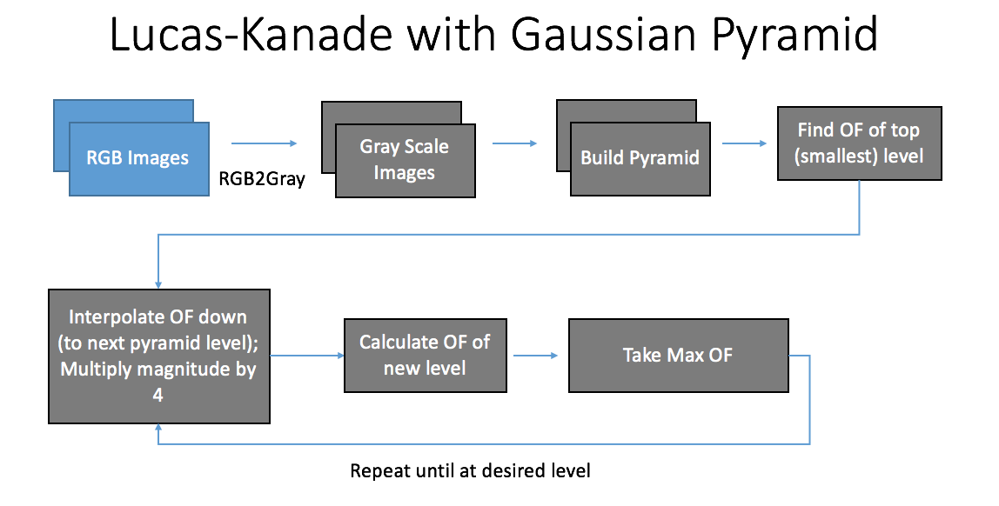

# Project 3: Optical Flow

## Abstract
In this project, I implemented the Lucas-Kanade method of estimating dense 
optical flow (OF) from a pair of related images. On top of the normal optical flow
algorithm, I also implemented a Gaussian pyramid to better track large and small 
scale flows. 

## Algorithm

The Lucas Kanade algorithm starts by converting both images to gray scale. From 
the gray scale images, we then computed the spatial intensity gradients `dX` 
and `dY` of image2. We then compute the temporal gradient the same way we did in 
project 1, by subtracting the second image from the first. We then collect the 
terms in an `NxN` window centered around each pixel from the `dX` and `dY` 
spatial gradients and combine them in a single `N^2x2` matrix `A`. It is 
interesting to note, the resulting matrix of `A^T * A` is actually the Harris 
Corner Matrix. 

The basic overview for dense optical flow is shown in the figure below. 

The disadvantage of the basic Lucas-Kanade algorithm is that large flows of 
motion are difficult to capture and often introduce noise into the results. One
way to address this issue is to take the OF at multiple scales - starting at 
the samllest version of the image and down to larger versions of the image. This
works because large small movements at the original image scale will be lost as 
the image is shrunk - therefore allowing larger flows to be captured on the 
smaller images. The OF from smaller images can then be propagated into the next 
layer and be used to help find the OF at the larger layer. This new flow layer 
will be based on the original flow layer but will now capture more of the smaller
movements previously lost in the shrunken image. This process repeats until
the image has been returned to its normal size.

Smaller versions of the image are found by applyinga Gaussian Blur to the image,
and then subsampling every other row and column in the image. This effectively 
reduces the image to 1/4 (half the rows and half the cols). Blurring helps reduce
the amount of data lost in the subsample. A flow chart for the process of building
a Gaussian Pyramid is shown in the following figure.

## Experiments
## Conclusion
