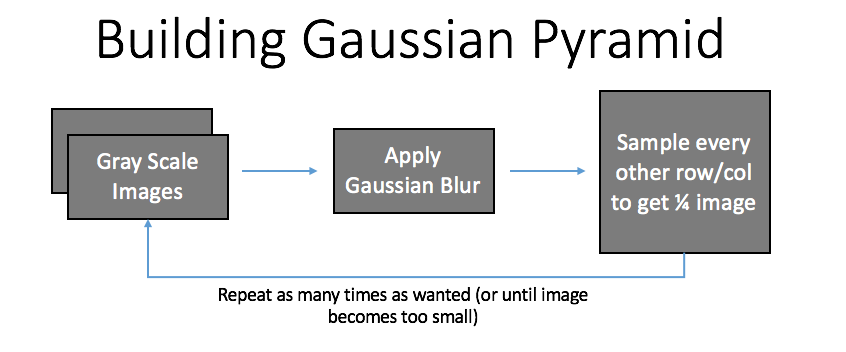

# Project 3: Optical Flow

## Abstract
In this project, I implemented the Lucas-Kanade method of estimating dense 
optical flow from a pair of related images. On top of the normal optical flow
algorithm, I also implemented a Gaussian pyramid to better track large and small 
scale flows. 

## Algorithm

The basic overview for dense optical flow is shown in the figure below. 

The algorithm starts by converting both images to gray scale. From the gray scale
images, we then computed the spatial intensity gradients Ix and Iy of image2. 
We then compute the temporal gradient the same way we did in project 1, by 
subtracting the second image from the first. We then collect the terms in an `NxN`
window centered around each pixel from the `dX` and `dY` spatial gradients and 
combine them in a single `N^2x2` matrix `A`. It is interesting to note, the 
resulting matrix of `A^T * A` is actually the Harris Corner Matrix. 

## Experiments
## Conclusion
