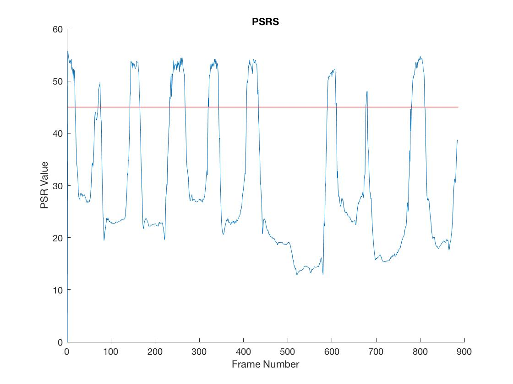
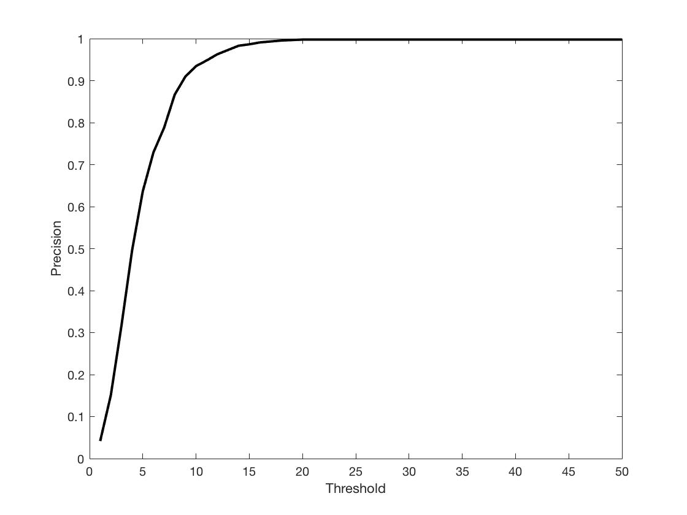
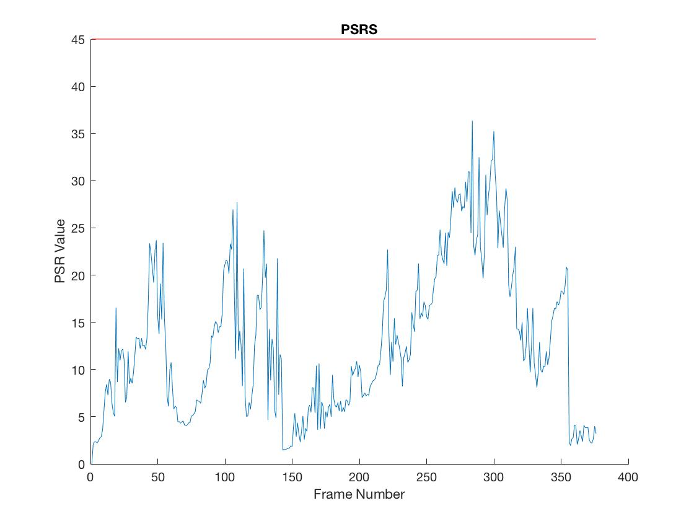

# Project 4: Occlusion Detection with the Circulant Matrix tracker

## Abstract
In this project, we adapted the circulant matrix tracker (CMT) to detect occlusion
during tracking. We further attempted to predict the motion of the object over
time to assist in recovery from occlusion.

## Occlusion Detection
The model of the CMT gradually changes over time to account for changes
in the appearance of the tracked object. This makes it especially important to
detect when occlusions occur to prevent the tracker from "learning" on the occluding
object.

In this figure, we can see as the book crosses in front of the persons face,
noise is introduced to the response values across image. As the book settles for
a couple frames, the noise gradually dies down as the CMT "learns" what the book
looks like.

The CMT uses a peak response filter to predict the likelihood that the given target
exists in a window in an image. Finding the pixel with the maximum response value
indicates the best match the tracker.

By taking the peak to side-lobe ratio (PSR), we estimate how certain the tracker
is a particular point represents the center of the tracked object. Low ratios
indicate the tracker is less certain of the outcome with weight being spread
across a number of possible pixels. This uncertainty could also represent an
occlusion. By thresholding the PSR value, we could estimate when the tracked
target was occluded.

In this figure, we interpret any frame with a PSR < 45 to be an occlusion. We can
see that whenever the book crosses over the woman's face, an occlusion is detected.
When the occlusion is detected, the tracker does not update its model, thus
preventing the tracker from learning (and in the future, tracking) the book.
The response graph shows that the model does not update with the appearance of
the book because the noise introduced by the appearance of the book does not fade
away like the previous example.

Looking at the PSR graph, over time, its easy to determine to see when occlusions
over the course of the video.

Precision Graph of the CMT with Occlusion Detection

<!--
 -->

### Difficulties
There were two major difficulties I encountered when trying to detect occlusion.

The first is that there isn't a simple way to determine a threshold value to use
for detection - the cutoff value varies significantly depending on the sequence
being used. In previous example sequence, 45 worked well as a cutoff, but the same
value could not be used in a different sequence since the PSR values on the whole
were significantly higher with 45 being too low to effectively detect occlusion.

The second, even more complex issue is differentiating change in appearance from
occlusion. The idea behind the learning property of the CMT is that the tracker
adapts to changes in appearance of the desired object over time so it can still
track the object even with changes in orientation or slight occlusion.
Unfortunately, changes in appearance also result in low PSR values - values that
are marked as occlusion when they're detected resulting in the tracker NOT learning
on those frames.

In this example, occlusion detection was turned off to allow the tracker to train
on all frames. This allowed the tracker to perform very well, following the surfer
through his entire sequence of motions. Watching the video, it becomes clear that
no occlusion occurs during the course of the sequence - while his face is not always
visible, nothing ever blocks his head as a whole. However, when the PSR graph is
examined, the values over time range wildly.

These results show the complexity of detecting occlusion based solely on the PSR
value of the frame: the change in pose results in drops in the PSR value similar
to that of an occlusion.

## Motion Prediction
For this project, I implemented a simple constant acceleration estimation of the
tracked target. This model takes the last three measurements of the position
and uses them to find the instantaneous velocity and acceleration.
Using this information, its possible to estimate the position of the target `n`
frames after an occlusion was detected. This estimation is helpful for searching
and recovering a lost target after occlusion.

While this will work for simple cases where constant acceleration IS the correct
model to use, it will fail if the true model is more complex, for example, the
a video of a bouncing ball being occluded behind a garbage can. In these more
complex examples, the Henkel matrix can be used to capture the higher order movement.
